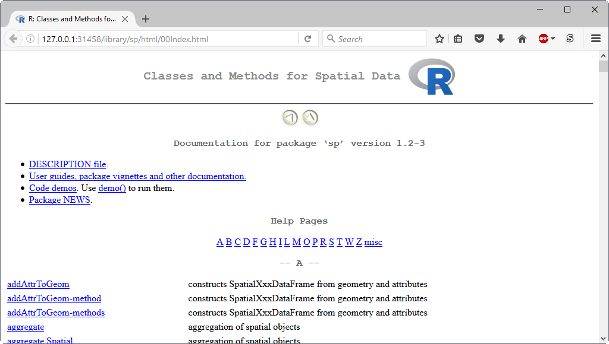

Over the course of this 1-day workshop you will learn the basics of the R-programming language and
how to use R (and related software) for data analysis, graphics, and reproducible research.
No prior programming experience is needed.
After completing the workshop you should have enough experience and
skills to get started analyzing your own data in R, or at the very least,
you'll be provided resources for learning how to learn R on your own.
Throughout the workshop I encourage you to ask questions and get help from those around you.
Software used in the workshop should be installed on your computer prior to instruction.

## Tentative Schedule

- Introduction to R

- [Software](software.html) installation instructions for R and its development environment.

- [Git lessons](git-lessons.html) covering the basics of using a version control system.

- [R lessons](r-lessons.html) covering data structures, subsetting, reading data,
  temporal and spatial analysis.

- Questions/Final thoughts

## What is R?

[R](https://www.r-project.org/about.html) is a high-level programming language used primarily for
data analysis, statistical computing, and graphics.

## Assessment of R

**Advantages:**

- It's free and open-source software that is available for most operating system's (OS's)
  (such as Windows, OS X, and Linux).

- Because your work is stored in scripts, and the software is freely available, anyone can easily replicate it.
  This is often not the case for graphical user interface (GUI)-driven workflows, such as those relying on Excel or ArcGIS.

- It is extensible and offers robust tools for developers to build their own packages,
  these are collections of functions, data, and compiled code in a well-defined format.
  There are many packages available for download that address almost all of your data science needs,
  everything from statistical modelling to machine learning.

- Provides immediate access to the very latest statistical techniques and implementations.

- It has an extremely active community dedicated to helping each other.
  There are a variety of forums for asking questions, such as the
  [R mailing lists](https://www.r-project.org/mail.html).

- Provides tools for communicating your research using dynamic
  [report](https://yihui.name/knitr/) and
  [website](http://rmarkdown.rstudio.com/rmarkdown_websites.html) generation.

- Designed to connect to other programming languages such as
  C, Fortran, C++, SQL, and tcl/tk.

- Includes many functions that can be used for reading, visualizing, and analyzing
  geographical [spatial data](https://CRAN.R-project.org/view=Spatial).

**Disadvantages:**

- Scientists without programming experience are often frustrated by R's steep learning curve.
  It can be difficult to remember R syntax and function names,
  especially if you don't code on a regular basis.

- The quality of contributed packages can vary from awful to excellent.
  Therefore, determining which package to apply to a given problem can be a little overwhelming.

- R is not a high-performance programming language like C and Fortran,
  and it's not uncommon to run into memory limitations.
  These issues are partly attributed to poorly written R code.

- Documentation is sometimes patchy and terse.

## Using R

R should be accessible from the start menu, desktop shortcut, or command shell.
Assuming you installed R on a 64-bit OS, two versions of R are made available, that is, a 32-bit and 64-bit version.
The 64-bit version of R (R x64) is preferred.
Startup an R session.
For Windows users you will be opening a GUI for R called the "R Console".
You will notice a number of pull-down menus that look something like this


Because everything in R can be done from the command line,
these pull-down menus are unnecessary for working in R.
That said, they do provide a convenient way to execute common tasks in R,
such as updating packages, installing package(s) from local files, or opening help documentation.

#### Exercise

1. Spend a little time getting familiar with the R Console.

2. Type `pi + 10` into the console at the command prompt `>` and press Enter.

3. How many significant figures are displayed?

### Functions

As John Chambers ([2008](https://www.springer.com/gp/book/9780387759357)) states:

> Nearly everything that happens in R results from a function call.
> Therefore, basic programming centers on creating and refining functions.

He goes on to explain that

> everything is an object---the arguments, the value, and in fact the function and
> the call itself: All of these are defined as objects.

To better understand functions, let's write our own.
Paste the following code into your console:

```{r, eval=FALSE}
sum.of.squares <- function(x, y) {
  return(x^2 + y^2)
}
```

You have now created a function called `sum.of.squares` which requires two arguments
and returns the sum of the squares of these arguments.
Since you ran the code at the command prompt, the function is now available,
like any of the other built-in functions within R.
Running `sum.of.squares(3, 4)` will give you the answer `25`.

The procedure for writing any other functions is similar, involving three key steps:
(1) define the function,
(2) load the function into the R session, and
(3) use the function.

#### Define a function

The basic syntax of functions is given below:

```{r, eval=FALSE}
FunctionName <- function(arg.1, arg.2, arg.3 = 2, ...) {
  new.var <- arg.1 + arg.2  # comment
  return(new.var / arg.3)
}
```

where

- `FunctionName` is the name of the function.
  This can be any valid variable name, but you should avoid using names that are used elsewhere in R,
  such as dir, function, plot, etc.

- `function` is a reserved word in R that is used to provide a mechanism for defining new functions in R.

- `( )` is used to contain function arguments.
  Parenthesis can also be used in mathematical expressions to denote
  modifications to normal order of operations (precedence rules).

- `arg.1`, `arg.2`, `arg.3` are the arguments of the function.
  You can write a function with any number of arguments.
  These can be R objects: numbers, strings, arrays, data tables, or even pointers to other functions;
  anything that is needed for the function to run.
  Some arguments have default values specified, such as `arg.3 = 2` in our example.
  Arguments without a default must have a value supplied for the function to run.
  You are not required to provide a value for those arguments with a default,
  as the function will use the default value.

- `...` is a special argument called the ellipsis.
  This argument will match any arguments not otherwise matched, and can be easily passed on to other functions.
  This technique is often used in plotting, but also has uses in many other places.
  For this example function it was not used, but included in order to make you aware of its existence.
  An example of a function that uses the ellipsis argument is given in the "Ellipsis argument" section.

- `{ }` is used to contain the function body, code that is run every time the function is called.

- `<-` is an assignment operator.
  In the example function, the first and second arguments are summed (`arg.1 + arg.2`) and
  the result is assigned to a new variable (`new.var`).

- `#` is the character defining comments, the rest of the line after this character is ignored.

- `return` is a function in R.
  If the end of a function is reached without calling this function, the value of the last evaluated expression is returned.
  Therefore, it was not needed in the example function.

#### Load a function

For R to be able to run your function, it needs first to be read into memory.
There are two methods for loading functions into the memory:

1. copy the function text and paste it into the console, or
2. use the `source(file)` function to load your function(s) from a file.

The `file` argument in the `source` function is typically specified as a character string
giving the pathname of the file or URL to read from.
One could also specify the name of the file and the `source` function will assume the file is located in the *working directory*.
Every R session has a default location on your OS's file structure called the working directory.
You need to keep track and deliberately set your working directory in each R session.

The `getwd` function tells you what the current working directory is.
For my current R session the working directory is:

```{r}
getwd()
```

To change the working directory, use the `setwd(dir)` function,
where `dir` is the pathname of the new working directory.
Be sure to enter the new working directory as a character string (enclose it in quotes) and
specify the separator between folders using a forward slash (/).
For Windows users, the forward slash will look strange because you're used to the backslash (\\) separator
used by File Explorer (previously known as Windows Explorer).

#### Exercise

This exercise will test your ability to define and load a function into R.

1. Copy (CTRL+C) the example function from above and paste (CTRL+V) it into
   a *New File* in your text editor, such as Notepad++.
2. Save the file to a folder of your choosing and name it "function.R"---the
   ".R" file extension indicates an R-source (script) file.
3. Set the working directory to the folder containing your R-source file.
4. Load the function into your current R session using the `source` function.
5. Confirm that your function is available for use by typing `ls()` to
   list all R objects you've created or loaded during your R session.
6. Run the function passing what you think are appropriate arguments.
7. Repeat the process by refining the function, loading it into the R session, and using it.

One trick for working in a console is to use the up and down arrows to recall previously used commands.

#### Ellipsis argument

The ellipsis argument `...` is a way of passing an arbitrary number of arguments to a function inside another function.
For example, suppose you wanted to define a function that adds noise to your data and plots the results.
You can define the function as

```{r}
PlotNoisyData <- function(x, y, ...) {
  new.y <- y + rnorm(length(y), 0, 5)
  plot(x, new.y, ...)
}
```

Notice that both the `PlotNoisyData` function and the embedded `plot` function include an ellipsis argument `...`.
Now we can run the function and not only pass the required data arguments (`x` and `y`)
but also a set of optional graphical arguments (`type` and `col`) that are
accepted by the `plot` function and passed through `...` .
An argument specification of `type = "b"` indicates that both points and lines are desired,
whereas `col = "red"` indicates that the drawn points and lines will be the color red.

```{r, echo=FALSE}
set.seed(1)
```

```{r intro-ellipsis}
PlotNoisyData(x = 1:50, y = rep(0, 50), type = "b", col = "red")
```

### Packages

As Hadley Wickham ([2015](http://r-pkgs.had.co.nz/intro.html)) states:

> In R, the fundamental unit of shareable code is the package.
> A package bundles together code, data, documentation, and tests, and is easy to share with others.

There are a core set of "standard" packages included with an installation of R,
and many more available through the
**C**omprehensive **R** **A**rchive **N**etwork (CRAN) and other repositories.
Of the thousands of "contributed" packages, written by many different authors,
their primary purpose is to extend the capabilities or R.
For example, the **knitr** package provides a general-purpose tool for dynamic report generation in R.
To see which packages are installed on your computer, the command is

```{r, eval=FALSE}
library()
```

And to see which packages are currently loaded in your R session, use

```{r, eval=FALSE}
search()
```

#### Installing packages

R packages only need to be installed once on your computer.
Use the `install.packages` function to install packages from a CRAN-like repository.
For example, to install the **inlmisc** package from CRAN, use the command

```{r, eval=FALSE}
install.packages("inlmisc", dependencies = TRUE)
```

By default, `install.packages` also installs the packages which **inlmisc** depends on, links to, or imports;
see the [package description](https://CRAN.R-project.org/package=inlmisc) for its dependencies.
If you wish to install a package from a different CRAN-like repository,
such as the **G**eological survey **R** **A**rchive **N**etwork ([GRAN](https://owi.usgs.gov/R/gran.html)),
the `repos` argument must be specified.
For example, to install the **smwrData** package from GRAN, use

```{r, eval=FALSE}
repos <- c(GRAN = "https://owi.usgs.gov/R", CRAN = "https://cran.r-project.org/")
install.packages("smwrData", repos = repos)
```

Notice that a CRAN repository was also included in the command,
this ensures that any package dependencies residing on CRAN will also be installed.
To install a package from a locally stored ZIP file, use

```{r, eval=FALSE}
install.packages(file.choose(), repos = NULL)
```

Notice that the `file.choose()` command was used in place of a package name,
this will allow you choose the ".zip" file interactively.

Sometimes a package of interest is only available on [GitHub](https://github.com/).
To install a package directly from a GitHub repository, use the `install_github` function in the **devtools** package.
For example, to install the **AnomalyDetection** package from its
GitHub [repository](https://github.com/twitter/AnomalyDetection), use the command

```{r, eval=FALSE}
devtools::install_github("twitter/AnomalyDetection")
```

#### Updating packages

Run the `update.packages()` command to ensure that all the packages in your local R library are up to date.
It downloads the list of available packages and their current versions,
compares it with those installed and offers to download and install any that have later versions on the repositories.

#### Load a package

Only when a package is loaded are its contents (functions, datasets, and documentation) available in your R session.
The `library` function is used to load a package into the current R session.
For example, to load the **viridisLite** package use the command

```{r}
library(viridisLite)
```

### Help

Being able to find help and interpret that help is one of the most important skills for learning a programming language.

#### Getting help from the console

To start R's online documentation in a web browser, the command is

```{r, eval=FALSE}
help.start()
```


To get more information on any specific package, such as the **sp** package, the command is

```{r, eval=FALSE}
help(package = "sp")
```



And to open the help documentation for a specific function, such as the `bbox` function, the command is

```{r}
?bbox
```

Wait a gosh-darn minute, that didn't work!
It appears that R is unable to find the help documentation for `bbox` because it belongs to the **sp** package.
We never loaded the **sp** package, so it should come as no suprise that its documentation is unavailable for use.
At this point, you can either
(1) do a fuzzy match of the function name using the `??bbox` command,
    as recommended in the error message and appropriate when you don't know the package name;
(2) load the **sp** package using the `library` function and rerun `?bbox`; or
(3) bypass the package loading step by running the command

```{r, eval=FALSE}
?sp::bbox
```


#### Task views

[CRAN Task Views](https://cran.r-project.org/web/views/)
are guides to the packages and functions useful for certain disciplines and methodologies.
These guides are maintained by volunteers with expertise in a specified area.
The maintainers provide annotated guidance to routines and packages.
This is particularly helpful to track new packages or functionality.

#### Other resources

There are endless resources online, here's just a few

- [R for cats](https://rforcats.net/) is a lighthearted introduction to
  the R-programming language.

- [R-bloggers](https://www.r-bloggers.com/) is a blog aggregator of content contributed by
  bloggers who write about R.

- [StackOverflow](https://stackoverflow.com/questions/tagged/r) is a discussion forum for
  all things related to programming.

- [R for Data Science](http://r4ds.had.co.nz/index.html), a book by Hadley Wickham.

#### Exercise

1. Spend a little time exploring R's online documentation.

2. Find a function in the **stats** package that can be used for fitting linear models.

3. Open the functions help documentation and run its example code.

4. Open the help documentation for Edgar Anderson's `iris` dataset and run its example code.

5. Open a task view of your choosing and explore available packages.

### Closing R

Every time you terminate an R session,
by either typing `q()` at the command prompt or manually shutting down the R Console via point-and-click,
you are prompted as to whether to save the workspace image, it may look something like this


Your workspace image consists of all R objects you've created or loaded during your R session.
Recall that you can use the `ls()` command to list these objects.
When R asks if you want to save your workspace image, and you respond *No*,
all of the new objects you've created during the current R session are deleted forever.
If you say *Yes*, the `save.image` and `savehistory` functions are run and
result in files ".RData" and ".Rhistory" being written to (updated in) your working directory.
The ".RData" file stores your R objects and
the ".Rhistory" file stores a transcript of your previous commands entered at the command prompt.
The next time you start an R session in this directory,
your workspace image is restored and all objects and commands will be made available for use.

My recommendation to you is to **never save your workspace image**.
This is because your code should almost always be typed in a script file and not directly in the console.
In other words, save your R-source code in a text file
(adhering to a [style guide](https://google.github.io/styleguide/Rguide.xml)),
and then just load the code into a new R session to re-create the previous workspace.
In my opinion, this is the key behind making your work reproducible.

## Acknowledgements

I'd like to acknowledge that certain material has been borrowed for the workshop,
and thank them for openly sharing their materials.
Sources of material include:

- USGS R training course -- [Introduction to R](https://owi.usgs.gov/R/training-curriculum/intro-curriculum/)

- Hadley Wickham's book -- [Advanced R](http://adv-r.had.co.nz/)

- Nice R Code blog -- [The Nice R code guides to...](https://nicercode.github.io/guides/functions/)

- Tutorials by William B. King -- [Saving and Loading Objects in R](https://ww2.coastal.edu/kingw/statistics/R-tutorials/savingloading.html)

- SAS and R blog -- [another look at CRAN Task Views](https://sas-and-r.blogspot.com/2011/05/another-look-at-cran-task-views.html)
