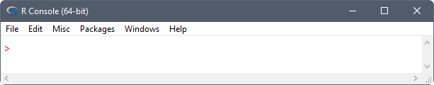

Over the course of this 1-day workshop you will learn the basics of the R-programming language and
how to use R (and related software) for data analysis, graphics, and reproducible research.
No prior programming experience is needed.
After completing the workshop you should have enough experience and
skills to get started analyzing your own data in R, or at the very least,
you'll be provided resources for learning how to learn R on your own.
Throughout the workshop I encourage you to ask questions and get help from those around you.
Software used in the workshop should be installed on your computer prior to instruction.

## Tentative Schedule

* Introduction to R

* [Software](software.html) installation instructions for R and its development environment.

* [R lessons](r-lessons.html) covering data structures, subsetting, reading data,
  temporal and spatial analysis.

* [Git lessons](git-lessons.html) covering the basics of using a version control system.

* Questions/Final thoughts

## What is R?

[R](https://www.r-project.org/about.html) is a language and environment for data analysis,
 statistical computing, and graphics.

## Assessment of R

Advantages:

* It's free and open-source software that is available for most operating system's (OS's)
  (such as Windows, OS X, and Linux).

* Because your work is stored in scripts, and the software is freely available, anyone can easily replicate it.
  This is often not the case for graphical user interface (GUI)-driven workflows, such as those relying on Excel or ArcGIS.

* It is extensible and offers robust tools for developers to build their own packages,
  these are collections of functions, data, and compiled code in a well-defined format.
  There are many packages available for download that address almost all of your data science needs,
  everything from statistical modelling to machine learning.

* Provides immediate access to the very latest statistical techniques and implementations.

* It has an extremely active community dedicated to helping each other.
  There are a variety of forums for asking questions, such as the
  [R mailing lists](https://www.r-project.org/mail.html) and
  [stackoverflow](http://stackoverflow.com/questions/tagged/r).

* Provides tools for communicating your research using dynamic
  [report](http://yihui.name/knitr/) and
  [website](http://rmarkdown.rstudio.com/rmarkdown_websites.html) generation.

* Designed to connect to other programming languages such as
  C, Fortran, C++, SQL, and tcl/tk.

* Includes many functions that can be used for reading, visualizing, and analyzing
  geographical [spatial data](https://CRAN.R-project.org/view=Spatial).

Disadvantages:

* Scientists without programming experience are often frustrated by R's steep learning curve.
  It can be difficult to remember R syntax and function names,
  especially if you don't code on a regular basis.

* The quality of contributed packages can vary from awful to excellent.
  Therefore, determining which package to apply to a given problem can be a little overwhelming.

* R is not a high-performance programming language like C and Fortran,
  and it's not uncommon to run into memory limitations.
  These issues are partly attributed to poorly written R code.

* Documentation is sometimes patchy and terse.

## Using R

R should be accessible from the start menu, desktop shortcut, or command shell.
Assuming you installed R on a 64-bit OS, two versions of R are made available, that is, a 32-bit and 64-bit version.
The 64-bit version of R (R x64) is preferred.
Startup an R session.
For Windows users you will be opening a GUI for R called the "R Console".
You will notice a number of pull-down menus that look something like:

| 

Because everything in R can be done from the command line,
these pull-down menus are unnecessary for working in R.
That said, they do provide a convenient way to execute common tasks in R,
such as updating packages, installing package(s) from local files, or opening help documentation.

#### Exercise

Spend a little time getting familiar with the R Console.
Please refrain from running *Update packages..." under the *Packages* menu during the workshop
because of the burden it would place on our centers internet bandwidth.
Let me know if anyone is having trouble opening an R session.

### Functions

As John Chambers ([2008](http://www.springer.com/gp/book/9780387759357)) said:

> Nearly everything that happens in R results from a function call.
> Therefore, basic programming centers on creating and refining functions.

He goes on to explain that

> everything is an object---the arguments, the value, and in fact the function and
> the call itself: All of these are defined as objects.

To better understand functions, let's write our own.
Paste the following code into your R session at the command prompt (`>`).

```{r, eval=FALSE}
sum.of.squares <- function(x, y) {
  return(x^2 + y^2)
}
```

You have now created a function called `sum.of.squares` which requires two arguments
and returns the sum of the squares of these arguments.
Since you ran the code at the command prompt, the function is now available,
like any of the other built-in functions within R.
Running `sum.of.squares(3, 4)` will give you the answer `25`.

The procedure for writing any other functions is similar, involving three key steps:
(1) define the function,
(2) load the function into the R session, and
(3) use the function.

#### Define a function

The basic syntax of functions is given below:

```{r, eval=FALSE}
FunctionName <- function(arg.1, arg.2, arg.3 = 2, ...) {
  new.var <- arg.1 + arg.2  # comment
  return(new.var / arg.3)
}
```

where:

* `FunctionName` is the name of the function.
  This can be any valid variable name, but you should avoid using names that are used elsewhere in R,
  such as dir, function, plot, etc.

* `function` is a reserved word in R that is used to provide a mechanism for defining new functions in R.

* `( )` is used to contain function arguments.
  Parenthesis can also be used in mathematical expressions to denote
  modifications to normal order of operations (precedence rules).

* `arg.1`, `arg.2`, `arg.3` are the arguments of the function.
  You can write a function with any number of arguments.
  These can be R objects: numbers, strings, arrays, data tables, or even pointers to other functions;
  anything that is needed for the function to run.
  Some arguments have default values specified, such as `arg.3 = 2` in our example.
  Arguments without a default must have a value supplied for the function to run.
  You are not required to provide a value for those arguments with a default,
  as the function will use the default value.

* `...` is a special argument called the ellipsis.
  This argument will match any arguments not otherwise matched, and can be easily passed on to other functions.
  This technique is often used in plotting, but also has uses in many other places.
  For this example function it was not used, but included in order to make you aware of its existence.
  An example of a function that uses the ellipsis argument is given at the end of this section.

* `{ }` is used to contain the function body, code that is run every time the function is called.

* `<-` is an assignment operator.
  In the example function, the first and second arguments are summed (`arg.1 + arg.2`) and
  the result is assigned to a new variable (`new.var`).

* `#` is the character defining comments, the rest of the line after this character is ignored.

* `return` is a function in R.
  If the end of a function is reached without calling this function, the value of the last evaluated expression is returned.
  Therefore, it was not needed in the example function.

#### Load a function

For R to be able to run your function, it needs first to be read into memory.
There are two methods for loading functions into the memory:

1. copy the function text and paste it into the console, or
2. use the `source(file)` function to load your function(s) from a file.

The `file` argument in the `source` function is typically specified as a character string
giving the pathname of the file or URL to read from.
One could also specify the name of the file and the `source` function will assume the file
is located in the #working directory#.
Every R session has a default location on your OS's file structure called the working directory.
You need to keep track and deliberately set your working directory in each R session.
If you read or write files to disk, this takes place in the working directory.
If you don't set the working directory to your desired location,
you could easily write files to an undesirable file location.

The `getwd` function tells you what the current working directory is.
For my current R session the working directory is:

```{r}
getwd()
```

To change the working directory, use the `setwd(dir)` function,
where `dir` is the pathname of the new working directory.
Be sure to enter the new working directory as a character string (enclose it in quotes) and
specify the separator between folders using a forward slash (/).
For Windows users, the forward slash will look strange because you're use to the backslash (\\) separator
used by File Explorer (previously known as Windows Explorer).

#### Exercise

Copy the example function from above and paste it into a *New File* in your text editor (Notepad++).
Save the file to your working directory and name it "function.R";
the ".R" file extension indicates that it's an R source file.
Next, load the function into your current R session using the `source` function.
Type `ls()` to confirm that the function is in your working directory.
Run the function passing what you think are appropriate arguments.
Repeat the process by refining the function, loading it into the R session, and using the function.
One trick in the R Console is to use the up and down arrows to recall previously used commands.

#### Ellipsis argument

The ellipsis argument `...` is a way of passing an arbitrary number of arguments
to a function inside another function.
For example, suppose you wanted to define a function that adds noise to your data and plots the results.
You can define the function as:

```{r}
PlotNoisyData <- function(x, y, ...) {
  new.y <- y + rnorm(length(y), 0, 5)
  plot(x, new.y, ...)
}
```

Now run the function passing additonal arguments that will be
automatically passed to the `plot` function called within the function body.
The arguments `type` and `col` describe the plot type and color, respectively.

```{r}
PlotNoisyData(x = 1:50, y = rep(0, 50), type = "b", col = "red")
```

### Packages

Something


### Help

Something


## Acknowledgements

I'd like to acknowledge that certain material has been borrowed for the workshop and
thank them for openly sharing their materials.
Sources of material include:

* USGS R training course - [Introduction to R](https://owi.usgs.gov/R/training-curriculum/intro-curriculum/)

* Hadley Wickham's website for [Advanced R](http://adv-r.had.co.nz/), a book in Chapman & Hall's R Series.

* Nice R Code blog - [The Nice R code guides to...](https://nicercode.github.io/guides/functions/)

## Website Information

This website was written in [Rmarkdown](http://rmarkdown.rstudio.com/) and
rendered as a static website using the [rmarkdown](https://CRAN.R-project.org/package=rmarkdown) package.
Website files are hosted using [GitHub Pages](https://pages.github.com/)
and the complete source is available on [GitHub](https://github.com/jfisher-usgs/r-workshop).
