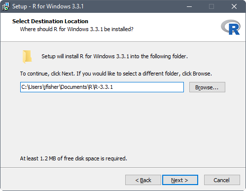
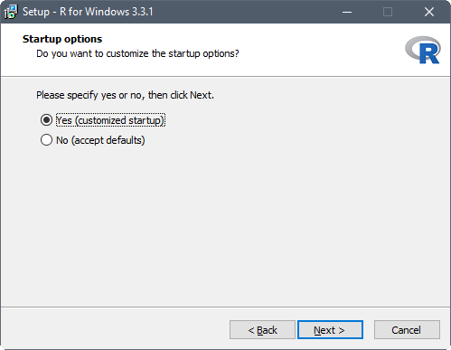
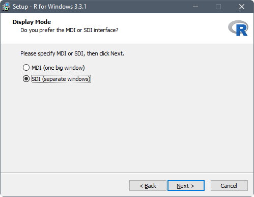
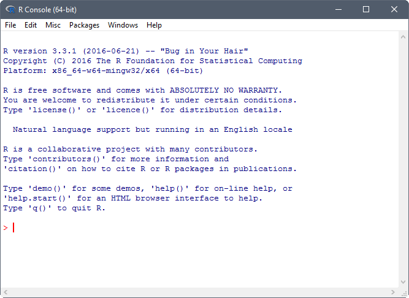
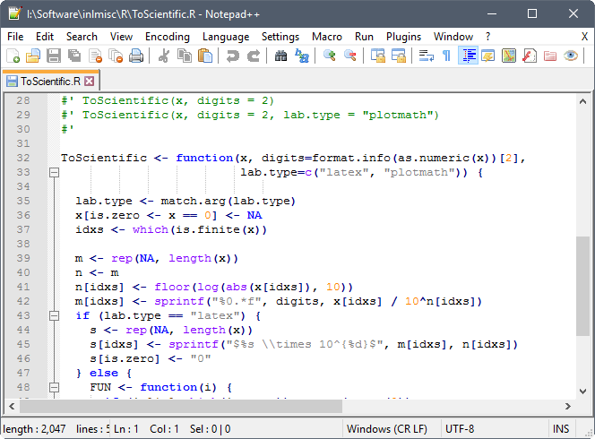
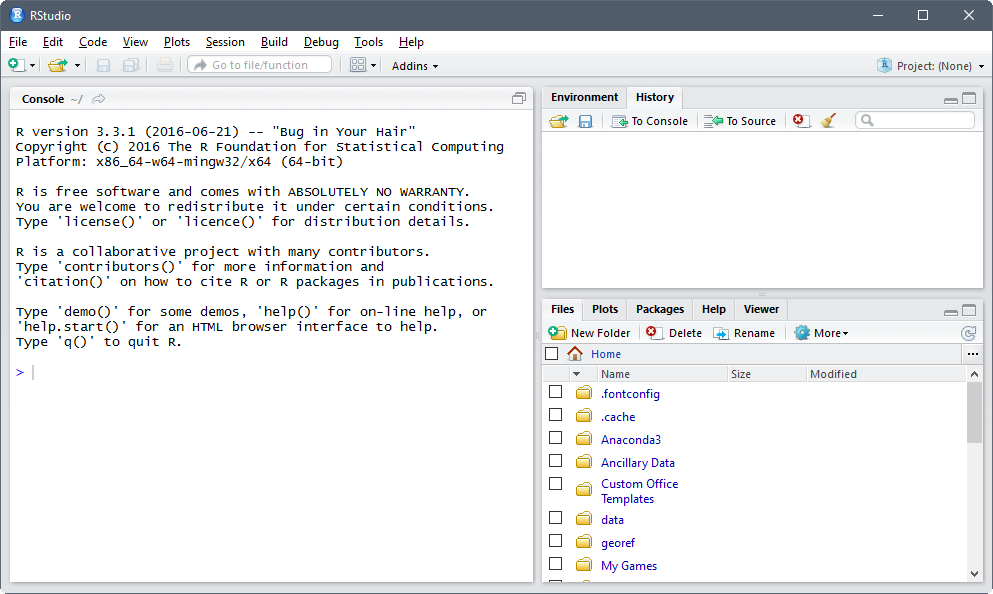
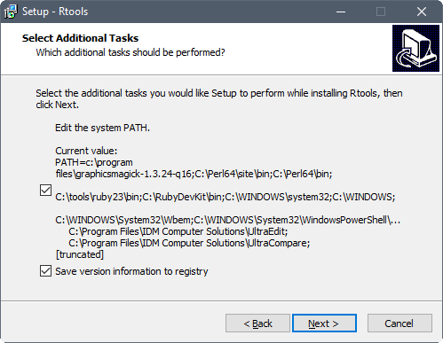
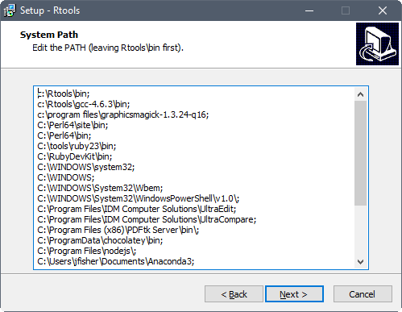

Prior to the start of the workshop everyone bringing a computer will need to have had the software installed and tested.
Below are the instructions for installing software used in this workshop (some are optional).
If you do not have install access to your computer,
you will need to contact your IT representative to have them install it.
You can give them a link to this page for instructions.
These instructions are for installing software on a Windows operating system (OS).

# R

[Download](http://cran.rstudio.com/bin/windows/base/)
the latest binary distribution of R from the Comprehensive R Archive Network (CRAN).
Once the installer downloads, double left-click the installation file.
Accept default options on all but the following dialogs.

Set the default location for the R installation to someplace you have write access, such as your Documents folder.
This may already be the default if you're not installing with administrator privileges.

| 

Customize startup options by specifying *Yes (customized startup)*.

| 

Set the R console to operate with multiple top-level windows for the console,
graphics and pager, by specifying *SDI (separate windows)*.

| 

Once installed, R should be accessible from the start menu or desktop shortcut.
Assuming you installed R on a 64-bit OS, two versions of R are made available, that is, a 32-bit and 64-bit version.
The 64-bit version of R (R x64) is preferred.
Startup an R session.
Once running the R console should look something like:

| 

# Notepad++

If you don't already have a favorite text editor (Notepad and Wordpad don't count, UltraEdit does)
[download](https://notepad-plus-plus.org/download/)
the latest 32-bit version of Notepad++.

Once the installer downloads, right-click on it and select "Run as administrator".
Accept default options on all dialogs.

Once installed, Notepad++ is accessible from Windows Explorer,
right-click on a text file (such as an R source file) and select "Edit with Notepad++".
Once running the file is opened in the text editor and should look something like:

| 

# RStudio

RStudio requires an installation of R.
[Download](http://www.rstudio.com/products/rstudio/download/)
RStudio Desktop, an integrated development environment (IDE) for R.
Once the installer downloads, right-click on it and select "Run as administrator".
Accept default options on all dialogs.

Once installed, R should be accessible from the start menu.
Startup an RStudio session.
Once running the RStudio Desktop should look something like:

| 

# RTools

[Download](https://cloud.r-project.org/bin/windows/Rtools/)
the latest ("frozen" snapshot) collection of resources for building packages for R.
Once the installer downloads, right-click on it and select "Run as administrator".
Accept default options on all but the following dialog.

Select the additional task to edit the current value of the System Path.

| 

Confirm that "c:\\Rtools\bin" and "c:\\Rtools\\gcc-4.6.3\\bin" (version number may differ)
are located at the beginning of the System Path.

| 

Once installed, check if Rtools can be used in R.
Close the current R session and open a new R session.
Execute the `Sys.getenv("PATH")` command to see if Rtools is included in System Path.
You should see "c:\\\\Rtools\\\\bin;c:\\\\Rtools\\\\gcc-4.6.3\\\\bin;..." in the output.
