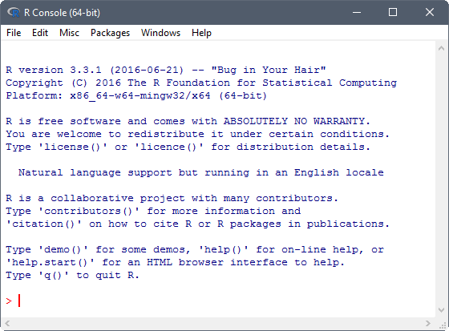
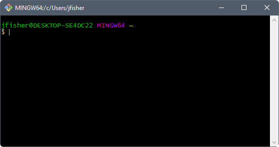
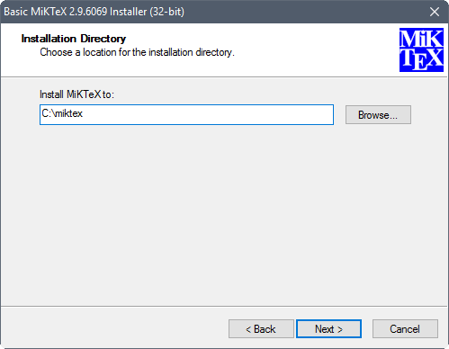

Prior to the start of the workshop everyone bringing a computer will need to have had the software installed and tested.
Below are the instructions for installing software used in this workshop.
If you do not have install access to your computer,
you will need to contact your IT representative to have them install it.
You can give them a link to this page for instructions.
These instructions are for installing software on a Windows operating system (OS).

## R

R is a programming language and software environment for statistical computing and graphics.
[Download](http://cran.rstudio.com/bin/windows/base/)
the latest binary distribution of R from the Comprehensive R Archive Network (CRAN).
Once the installer downloads, double left-click the installation file.
Accept default options on all but the following dialogs.

Set the default location for the R installation to someplace you have write access, such as your Documents folder.
This may already be the default if you're installing as a standard user, without administrative privileges.

| 

Customize startup options by specifying *Yes (customized startup)*.

| 

Set the R console to operate with multiple top-level windows for the console,
graphics and pager, by specifying *SDI (separate windows)*.

| 

Once installed, R should be accessible from the start menu or desktop shortcut.
Assuming you installed R on a 64-bit OS, two versions of R are made available, that is, a 32-bit and 64-bit version.
The 64-bit version of R (R x64) is preferred.
Startup an R session.
Once running the R console should look something like:

| 

Packages are collections of R functions, data, and compiled code in a well-defined format.
R comes with a standard set of packages.
Others are available for download and installation.

Install the following user-contributed packages available from
[CRAN](https://cloud.r-project.org/web/packages/)
by pasting the following code in the R console and hitting enter.

```{r, eval=FALSE}
install.packages(c("inlmisc", "dataRetrieval", "lattice", "ggplot2"))
```

## Notepad++

If you don't already have a favorite text editor
(Notepad and Wordpad don't count, [UltraEdit](http://www.ultraedit.com/) does),
[download](https://notepad-plus-plus.org/download/)
the latest 32-bit version of Notepad++.
Once the installer downloads, right-click on it and select *Run as administrator*.
Accept default options on all dialogs.

Once installed, Notepad++ is accessible from Windows Explorer,
right-click on a text file (such as an R source file) and select *Edit with Notepad++*.
Once running the file is opened in the text editor and should look something like:

| 

## RStudio

<span style="color:red;">Optional</span>:
RStudio requires an installation of R.
[Download](http://www.rstudio.com/products/rstudio/download/)
RStudio Desktop, an integrated development environment (IDE) for R.
Once the installer downloads, right-click on it and select *Run as administrator*.
Accept default options on all dialogs.
Once installed, R should be accessible from the start menu.
Startup an RStudio session.
Once running the RStudio Desktop should look something like:

| 

## RTools

<span style="color:red;">Optional</span>:
[Download](https://cloud.r-project.org/bin/windows/Rtools/)
the latest ("frozen" snapshot) collection of resources for building packages for R.
Once the installer downloads, right-click on it and select *Run as administrator*.
Accept default options on all but the following dialog.

Select the additional task to edit the current value of the System Path.

| 

Confirm that "c:\\Rtools\bin" and "c:\\Rtools\\gcc-4.6.3\\bin" (version number may differ)
are located at the beginning of the System Path.

| 

Once installed, check if Rtools can be used in R.
Close the current R session and open a new R session and type the following command
to see if Rtools is included in System Path.

```{r, eval=FALSE}
Sys.getenv("PATH")
```

You should see "c:\\\\Rtools\\\\bin;c:\\\\Rtools\\\\gcc-4.6.3\\\\bin;..." in the output.
R functions that simplify common package development tasks are inlcuded in the **devtools** package,
install it from CRAN.

```{r, eval=FALSE}
install.packages("devtools")
```

## Git

<span style="color:red;">Optional</span>:
[Download](https://git-scm.com/downloads)
the latest version of Git, a version control system that is used for software development and other version control tasks.
Once the installer downloads, right-click on it and select *Run as administrator*.
Accept default options on all dialogs.
Once installed, Git should be accessible from the start menu.

Open the **Git Shell** application, it should look something like:

| 

Tell Git your name so your commits will be properly labeled by typing the following command
(edit name, such as, "Jason Fisher"):

```{r, engine="bash", eval=FALSE}
git config --global user.name "YOUR NAME"
```

Tell Git the *email address* that will be associated with your Git commits.

```{r, engine="bash", eval=FALSE}
git config --global user.name "YOUR EMAIL ADDRESS"
```

## MikTeX

<span style="color:red;">Optional</span>:
[Download](http://miktex.org/download)
the latest 32-bit version of Basic MiKTeX, an implementation of
TeX/[LaTeX](https://en.wikipedia.org/wiki/LaTeX)
and related programs for Windows.
Once the installer downloads,
right-click on it and select *Run as administrator*.

| 

| 


Open the **MiKTeX Settings** application and select the *Roots* tab, it should look like this:

| 

Push the *Add...* button and select the root directory for R's LaTeX supplementary files.
Your looking for the *texmf* folder within the R installation, mine is located here:
"C:\\Users\\jfisher\\Documents\\R\\R-3.3.1\\share\\texmf".


## Texmaker

| 


